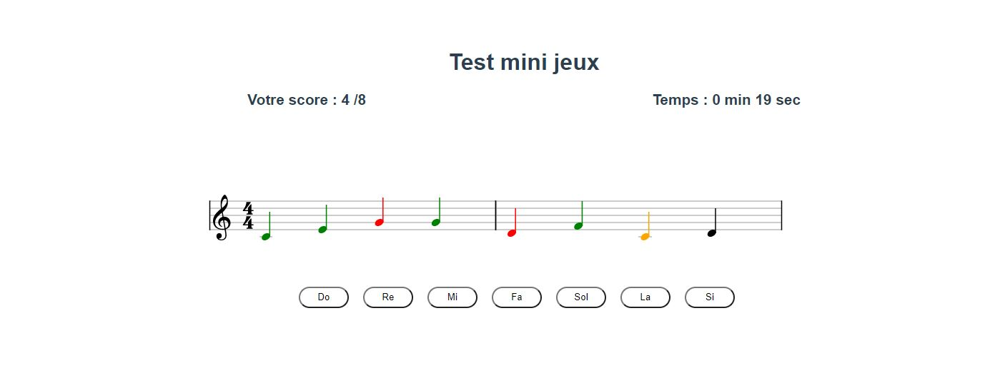
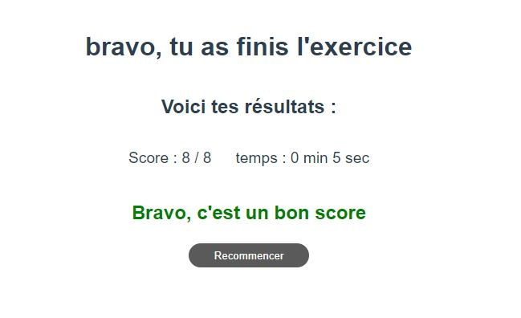
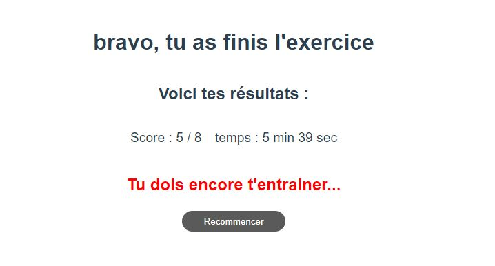

# Inspiring Music Theory - Lecture de note

Le premier jeux du projet : Un jeux de **lecture de note** développé avec Vue et Vexflow

## Table des matières

1. [Le principe](#Le-principe)
2. [Framework et librairies](#Framework-et-librairies)
3. [Les fonctions](#Les-fonctions)
4. [Améliorations à apporter](#Améliorations-à-apporter)
5. [Me contacter](#Me-contacter)

## Le principe



Le jeux est composé d'une partition de 8 notes **générées aléatoirement** entre Do et Si (_il est possible de modifier le choix des notes à afficher sur la partition_).
L'élève dispose de 7 boutons, chacun représentant une note, et doit cliquer sur le bouton correspondant à la note en cours (_celle en orange_).
Tout au long de l'exercice, un chronomètre permet d'afficher le temps que l'élève met a finir l'exercice et le score s'affiche.

Lorsque l'élève a finit, une page s'affiche récapitulant le score et le temps du joueur, ainsi qu'un commentaire sur sa performance et un bouton recommencer.





## Framework et librairies

Ce mini jeux est dévelloppé avec le framework javascript [Vue.js](https://vuejs.org/).

La librairies [VexFlow](https://github.com/0xfe/vexflow) permet de créer la partition.

## Les fonctions

- Random function

  ```javascript
  created : function(){//randomize}
  ```

  Cette fonction se déclenche lorsque le jeux est crée, et permet de créer aléatoirement un tableaux de 8 notes à partir de ce tableaux de base :

  ```javascript
  noteBase: [
        { note: "Do", value: "c/4" },
        { note: "Re", value: "d/4" },
        { note: "Mi", value: "e/4" },
        { note: "Fa", value: "f/4" },
        { note: "Sol", value: "g/4" },
        { note: "La", value: "a/4" },
        { note: "Si", value: "b/4" },
      ],
  ```

- chrono()

  Permet de d'actualiser le chronomètre tout au long du jeux. C'est une fonction asynchrone qui est appelé une fois a la création du jeux :

  ```javascript
  chrono() {
      setInterval(() => {
        if (this.sec == 59) {
          this.sec = 0;
          this.min++;
        }
        this.sec++;
      }, 1000);
    },
  ```

- removeNode()

  Fonction qui permet de supprimer du DOM la div qui contient la partition
  (<div id="gameBox">) et en recrée une nouvelle dans laquelle la partition mis à jour est redessiné en fonction de la réponse du joueur (Avancer le curseur, colorié les notes précédente selon la reponse).

  Cette fonction est appelée à chaque réponse du joueur et appelle ensuite la fonction display().

- display()

  Fonction qui permet de dessiner la partition de musique, ainsi que les couleurs des différentes notes. Cette fonction est appelé a chaque fois que le joueur clique sur un bouton. Le curseur (_note orange_) se déplace à la note suivante, et les notes précédentes sont coloriés selon le résultat du joueur ( Rouge si il s'est trompé, vert sinon)

  Voici comment le curseur change de place sur la deuxième partie de la partition :

  ```javascript
  if (this.index >= 4 && this.index < 8) {
    // placement du curseur pour la deuxième partie de la partition
    notes2[this.index - 4].setStyle({
      fillStyle: "orange",
      strokeStyle: "orange",
    });
  }
  ```

  Voici comment les notes de la deuxième partie de la fonctions sont coloriées selon le résultat du joueur :

  ```javascript
  if (this.noteResult.length >= 5 && this.index < 8) {
    console.log("pass");
    // changement couleur notes precedentes deuxieme partie de la partition
    for (let i = 4; i < this.noteResult.length; i++) {
      notes2[i - 4].setStyle({
        fillStyle: this.noteResult[i],
        strokeStyle: this.noteResult[i],
      });
    }
  }
  ```

- scoreUpdate()

  Permet de mettre à jour le score du joueur selon sa réponse et permet également de stocké dans le tableau <noteResult> les réponse précédentes pour pouvoir colorier ensuite les notes

- again()

  Fonction appelée lorsque le jeux est finis et que le joueur veut recommencer. Permet de remmettre toutes les variables à 0.

  ```javascript
     again() {
      this.finish = false;
      this.score = 0;
      this.index = 0;
      this.sec = 0;
      this.min = 0;
      this.noteResult = [];
      this.removeNode();
    },
  ```

## Améliorations à apporter

Voici les différents points à implémenter pour finaliser le jeux

- [ ] Le responsive du mini-jeux
- [ ] Revoir le design et intégré la masquotte
- [ ] Eventuellement ajouter animation avec [Gsap](https://greensock.com/gsap/)
- [ ] Ajouter la possibilité de choisir l'écart des notes à afficher sur la partitions

## Me contacter

N'hésitez pas à me contacter pour suggérer d'autre améliorations :

- mail : romain.guar01@gmail.com || romain.guarinoni@eetu.imt-lille-douai.fr
- [Linkedin](https://www.linkedin.com/in/romain-guarinoni-535445189/)
